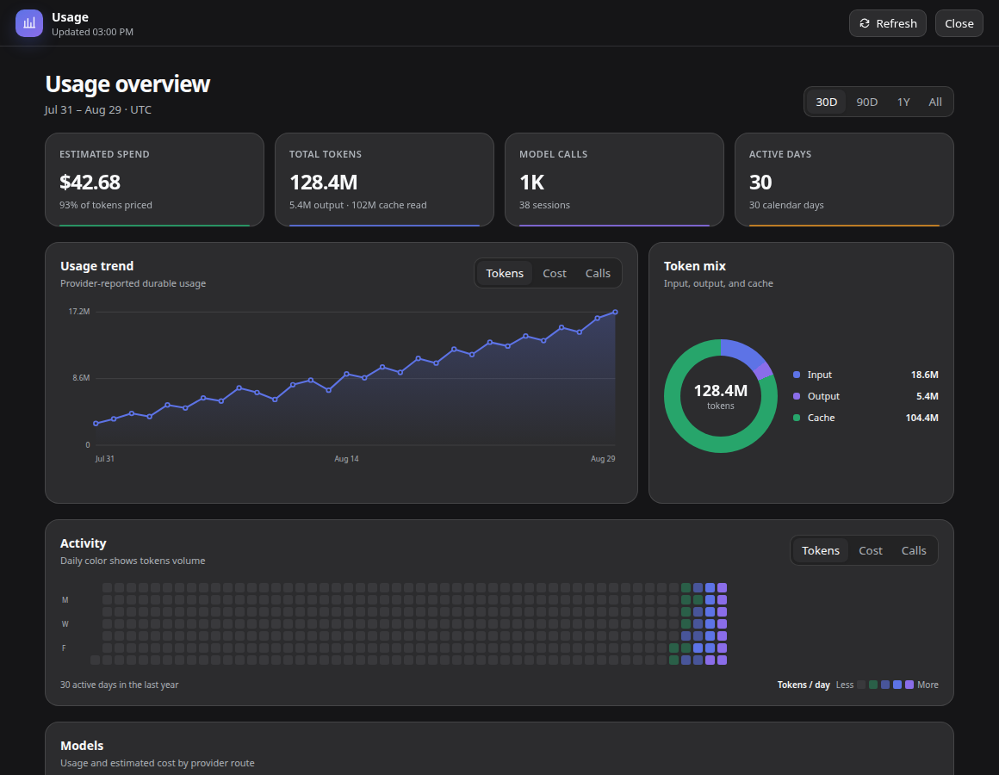

# DeepSeek Harness Usage

A local-first DeepSeek Harness plugin for token usage, estimated model cost, trends, and a GitHub-style activity heatmap.

> **Status:** MVP for `@deepseek-ai/dsh` `0.1.1-rc.2`. The plugin is read-only: the durable Harness session log remains the single source of truth and no parallel telemetry database is created.

<p align="center">
  
</p>

<p align="center"><sub>Rendered by the real plugin UI with deterministic demonstration data; no personal usage is shown.</sub></p>

## What works

- Full **Usage** workspace opened from the main sidebar.
- 30-day, 90-day, one-year, and all-time ranges.
- Summary cards for estimated spend, total tokens, model calls, sessions, and active days.
- Interactive trend chart for tokens, estimated cost, or calls, with pointer and keyboard tooltips.
- Input/output/cache token mix.
- Interactive 365-day activity heatmap with token/cost/call color modes, quartile intensity levels, and per-day details.
- Per-provider/model usage, session count, call count, token volume, and estimated cost.
- Browser timezone-aware day grouping.
- Revision-aware in-memory scan cache: unchanged durable sessions are not reparsed on every refresh.
- Responsive light/dark UI built on the supported DSH sidebar and center-workspace slots.

## Install

Requirements: Node.js 22+ and a working `dsh web` profile.

From npm:

```bash
dsh plugin --profile web add @syncended/dsh-usage
```

Or from this checkout:

```bash
pnpm install
pnpm check

dsh plugin --profile web add .
```

The package declares a DSH bundle, so `dsh plugin` appends it to the Web profile automatically. Restart the running `dsh web` process after installing or upgrading, refresh the existing page, and open **Usage** from the sidebar. The browser client reads the same Host through a package-owned same-origin endpoint; no separate URL, token, telemetry service, or plugin-specific environment variable is required.

To remove it:

```bash
dsh plugin --profile web remove @syncended/dsh-usage
```

## Pricing

Cost is an estimate derived from provider-reported token buckets and USD-per-million-token rules. The built-in catalog was verified on **2026-08-26 UTC** and contains 128 price/tier entries compiled into 289 provider-route rules for OpenAI GPT, Anthropic Claude, Google Gemini, DeepSeek, Z.AI GLM, Moonshot/Kimi, xAI Grok, Mistral, Cohere, Alibaba Qwen, and MiniMax.

See the [complete generated catalog](docs/pricing-catalog.md) for every model, price, condition, caveat, and official source URL. The engine handles prompt-length tiers and DeepSeek's recurring UTC peak/off-peak windows. It deliberately does not guess broad future model families: a route without a matching rule remains visible as **UNPRICED** and is excluded from estimated spend, while the dashboard reports pricing coverage.

Rules are matched in order against `provider/model`; `*` is the only route wildcard. Prompt tiers use `minPromptTokens` / `maxPromptTokens`, while known promotions and retirements use inclusive `validFrom` / exclusive `validTo` ISO-8601 instants. Calls outside a known validity interval remain unpriced rather than silently inheriting an expired rate.

Pricing changes over time, and batch/flex/priority service tiers, regional uplifts, negotiated rates, subscription plans, tool fees, and cache-storage duration may not map to token billing, so override the catalog for your environment when necessary. Current rules without an explicit validity interval remain current-list-price estimates rather than a historical invoice reconstruction.

To override pricing or scan behavior, edit the existing `usage` row in `$DSH_HOME/profiles/web/cordis.patch.yml`; do not add a duplicate row with the same id. Restart the Host after changing it:

```yaml
- id: usage
  config:
    scanConcurrency: 4
    pricing:
      - route: openai-codex/gpt-5.6-sol
        minPromptTokens: 272000
        input: 8
        output: 30
        cacheRead: 0.8
        cacheWrite: 10
      - route: openai-codex/gpt-5.6-sol
        maxPromptTokens: 271999
        input: 4
        output: 20
        cacheRead: 0.4
        cacheWrite: 5
      - route: my-provider/private-model
        input: 0.8
        output: 3.2
        cacheRead: 0.08
        cacheWrite: 0.8
```

All amounts are USD per one million tokens. Reasoning tokens are already included in the provider's output bucket and are not counted again.

## Data semantics

1. The host lists materialized sessions through `ctx.sessionPersistence.listSnapshots()`.
2. Changed sessions are read from the durable persistence prefix and accepted only when a second revision snapshot still matches, which avoids caching buffered live events under a durable revision. The capability transparently handles JSONL, compressed JSONL, SQLite, or another backend.
3. Usage chunks and final assistant-message usage are folded with one last-wins sample per `(turn, step)`, matching Harness token-meter semantics.
4. The exact provider/model route comes from request headers, request context, or the final model message source.
5. The browser requests an aggregate from the package-owned read-only `GET /api/usage` endpoint. Prompts, tool arguments, and message content are never returned.

The first dashboard load may scan historical sessions. Subsequent loads reuse cached results while each persistence revision is unchanged.

## Privacy and security

- No analytics leave the Harness host.
- No external telemetry or pricing requests are made.
- The HTTP API is same-origin and read-only.
- API output contains dates, route names, token counts, call/session counts, estimated costs, and aggregate read-error count. It does not include prompts, responses, paths, or session IDs.

## Development

```bash
pnpm install
pnpm check
npm pack --dry-run
```

The host plugin is strict TypeScript compiled to `dist/`. The external Web Client Plugin is a ready lazy-CJS module in `lib/client.js`, so it does not depend on unpublished DSH monorepo frontend tooling.

## License

MIT
